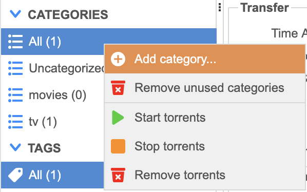

# Auto Jellyfin setup

I followed this [guide](https://github.com/bryce-hoehn/automated-jellyfin-guide?tab=readme-ov-file) for most of the setup, you can find the `compose.yml` file in this folder.

1. Copy this folder and it's contents to `~/docker/media`

I had to make the following changes compared to Bryce's guide:

- remove `network_mode: service:gluetun` from prowlarr, no need to restrict access through the gluetun container
- added tor container, required to access 1337x to bypass cloudflare

2. You can get everything running initially by running `sudo docker compose up -d` while in the main folder `~/docker`

## File Folder Structure

Create this file structure at the root. I did it at the root to make path mgmt easier in the compose file.

```
# assume root
sudo -i
mkdir -p /data/media/tv
mkdir -p /data/media/movies
mkdir -p /data/media/leaving-soon
mkdir -p /data/torrents/tv
mkdir -p /data/torrents/movies

#Recursively chown user and group (name of user, e.g. richard) and Recursively chmod to 775/664
chown -R $USER:$USER /data
chmod -R a=,a+rX,u+w,g+w /data

# exit root
<Ctrl + D>
```

This should be the result

```
data
├── media
│   ├── leaving-soon
│   ├── movies
│   └── tv
└── torrents
    ├── movies
    └── tv
```

## 1. Prowlarr setup

I setup prowlarr with nyaa.si and 1337x.to for anime and movies/shows. This may not be applicable if you use different trackers. Nyaa.si was simple to setup within prowlarr, however 1337x was a bit more difficult. The normal URL is blocked by cloudflare, however access through the tor network is unblocked.

To solve this, I added the `tor` container, which connects to the tor network, and I created `homelab/media/prowlarr/Definitions/Custom/1337x-tor.yml` which is configured to access 1337x through the tor network.

1. Access [http://localhost:9696/](http://localhost:9696/) or whichever IP from `ip a` (linux). If you're using Caddy as well, you should be able to access it through [http://prowlarr.home.arpa/](http://prowlarr.home.arpa/).
2. Under `Settings -> Indexers`, create new Indexer Proxy
   - Socks5
   - Host: `tor`
   - Port: `9050`
3. Add the `1337x-Tor` indexer:
   - Select the custom indexer `1337x (Tor)`
   - Select Base URL: `http://l337xdark...onion/`. Check [https://1337x.to/about](https://1337x.to/about) for the new onion URL if needed, and change it in the `1337x-tor.yml` file.
   - Select test, hopefully without any errors. You may have to wait a few minutes for the `tor` container to complete setup, you can check the logs using `sudo docker logs tor`

See [Prowlarr Quick Start Guide](https://wiki.servarr.com/prowlarr/quick-start-guide) for further configuration. This should be done after setting up qBittorrent, Sonarr, and Radarr because you'll need to link to their URLs and grab their API keys.

### Adding Apps

1. Navigate to `Settings > Apps`
2. Click `+` and select the app (e.g. radarr, sonarr)
3. Set `Prowlarr Server` to `http://prowlarr:9696`, which is the URL within the Docker network `media_net`
4. Set `Sonarr Server`/`Radarr Server` to `http://<sonarr/radarr>:9696`, using the URL within the Docker network `media_net` for either service.
5. Copy the API key from each app under `Settings > General > Security > API Key`
6. Test and add if it's all good (green check)

## 2. Other services

This follows Bryce's guide, which i've edited and pasted below. I also use the trash guides below.

[https://trash-guides.info/Downloaders/qBittorrent/Basic-Setup/](https://trash-guides.info/Downloaders/qBittorrent/Basic-Setup/)

### Jellyfin

1. Navigate to [http://localhost:8096](http://localhost:8096) (or [http://jellyfin.home.arpa](http://jellyfin.home.arpa))
2. Follow the setup wizard
3. Add libraries for TV and Movies. The library folders should be located at `/media/movies` and `/media/tv` respectively.

See [documentation](https://jellyfin.org/docs/general/quick-start.html) for more information

### qBittorrent

#### Change default login (Optional)

By default the login to the web UI is just "admin".

1. qBittorrent generates a random password on install. This password can be found by running `docker logs qbittorrent`.
2. Navigate to `Tools > Options > WebUI > Authentication`
3. Enter a new password.
4. Scroll to the bottom of any page and click `Save`

### Setting up save paths

1. Navigate to qBittorrent Web UI at [http://localhost:8080](http://localhost:8080) (or [http://jellyfin.home.arpa](http://qbit.home.arpa))
2. Under `Categories`, right click and `Add category` 
3. Enter `tv` for both `Category` and `Save Path`. 
4. Add another category for `movies`.
5. Click on `Tools > Options`
6. Under the `Downloads` tab,
   - Check `Delete .torrent files afterwards`
   - `Default Torrent Management Mode` to `Automatic`
   - `When Torrent Category changed` to `Relocate torrent`, `When Default Save Path changed` and `When Category Save Path changed` to `Relocate affected torrents`
   - Change `Default Save Path` to `/data/torrents`

7. Under the `Connection` tab,
   - Set `Peer connection protocol` to `TCP`
8. Scroll to the bottom of any page and click `Save`

#### Bind qBittorrent to VPN

This will ensure that qBittorrent only downloads over your VPN connection.

1. Go to the `Tools > Options > Advanced` tab
2. Change Network interface from Any to the interface corresponding to your VPN (probably something like `tun0`)
3. Scroll to the bottom of any page and click `Save`

### Sonarr / Radarr

#### Connect to qBittorrent

1. Navigate to `Settings > Downloads Clients > Add`
2. Select "qBittorrent"
3. Enter "qBittorrent" in the "Name" field
4. Set host to `gluetun` as qBittorrent is accessed through the `gluetun` container, and port to the qBittorrent port, default is `8080`. If you followed this guide correctly the default values should be correct
5. Enter the Username and Password for the webui
6. Set `Cateogry` to `tv`/`movies` (`sonarr`/`radarr`), this sorts torrents into each subfolder in qBittorrent
7. Click "Save"

#### Set root directory

1. Navigate to `Settings > Media Management`
2. Scroll to the bottom of the page and click on "Add Root Folder"
3. Sonarr: Select `/data/media/tv`
4. Radarr: Select `/data/media/movies`

#### Create quality profile

You will want to create a quality profile to specify what resolution you want your TV Shows and Movies to be.

1. Navigate to `Settings > Profiles`
2. Select the "Any" profile
3. Check all qualities you would like to allow and uncheck all qualities you would like to disable. For example if you want your movie quality to cap out at 1080p to save disk space uncheck everything above Bluray-1080p. Sonarr/Radarr will prioritize the highest allowed resolution but will download lower allowed ones if it can't find it.
4. (Optional) Allow upgrades by checking the "Upgrades Allowed" Checkbox. You can then change the "Upgrade Until" drop down to your prefered maximum resolution. This is useful for if you want your library to be entirely 1080p but the only torrent available for a specific show or movie is 720p. This way it will still download the 720p torrent but if a 1080p torrent ever comes along it will automatically download it and replace the 720p version.

#### File renaming (Optional)

I like having this setting enabled to keep my media folders nice and organized.

1. Navigate to `Settings > Media Management`
2. Check the checkbox under "Rename Episodes/Movies"
3. (Optional) Configure episode format by preference

### Jellyseerr

#### Connect Sonarr and Radarr

**Sonarr:**

1. Upon startup, configuration will prompt you for Sonarr details.
2. Enter hostname and port. If you followed this guide correctly it should just be sonarr:8989
3. Enter API key. You can find this in Sonarr under `Settings > General > Security`
4. Leave base URL blank unless you configured one in Sonarr/Radarr
5. Under Sonarr/Radarr Interface, check "Load Qualities", "Load Folders", and "Load Languages"
6. Select "Any" under Quality Profiles
7. Select `/data/media/tv` under Default Root Folders
8. Select your prefered languages under Language Profiles

**Radarr:**

1. Upon startup, configuration will prompt you for Sonarr details.
2. Enter hostname and port. If you followed this guide correctly it should just be radarr:7878
3. Enter API key. You can find this in Sonarr under `Settings > General > Security`
4. Leave base URL blank unless you configured one in Radarr
5. Under Radarr Interface, check "Load Profiles" and "Load Root Folders"
6. Select "Any" under Quality Profiles
7. Select `/data/media/movies` under Default Root Folders
8. Select "Physical / Web" under Default Minimum Availability. Optionally you could select and earlier setting in case a movie gets leaked before being released to DVD but you will more often than not probably just get cam recordings.

### Janitorr

I also have a separate service running which automatically delets media after a certain amount of time. You can configure it under `homelab/media/janitorr/config/application.yml`

The policy I currently set is:

```
  media-deletion:
    enabled: true
    movie-expiration:
      # Percentage of free disk space to expiration time - if the highest given number is not reached, nothing will be deleted
      # If filesystem access is not given, disk percentage can't be determined. As a result, Janitorr will always choose the largest expiration time.
      10: 5d # 10% free storage, delete after 5 days
      20: 7d # 1 week
      25: 14d # 2 weeks
      30: 20d # 20 days
    season-expiration:
      10: 5d # 5 days
      20: 7d # 1 week
      25: 14d # 2 weeks
      30: 20d # 20 days

```

You can delete the service from the `compose.yaml` if you don't want to delete files at all.

## 3. Usage

This is just a general guide to how I would use this, not a rule set. I found this helpful to wrap my head around things.

1. Open Jellyseer on a computer on the network (something like http://192.168.18.29:5055), and browse for shows and movies. This is where you request the content, which will get sent through the system.
2. You can monitor the shows and movies that have been added through Sonarr (shows) and Radarr (movies) through their web interfaces. YOu can monitor the torrents being downloaded through the qbittorrent web ui.
3. Open Jellyfin on the viewing device (TV app, or client computer) and you should see the requested media appear. It may take a minute to completely sync.
4. And thats it!

# Jellyfin on Samsung Tizen TV

I used this repo to install Jellyfin on my samsung tv: [https://github.com/PatrickSt1991/Samsung-Jellyfin-Installer.git](https://github.com/PatrickSt1991/Samsung-Jellyfin-Installer.git)
