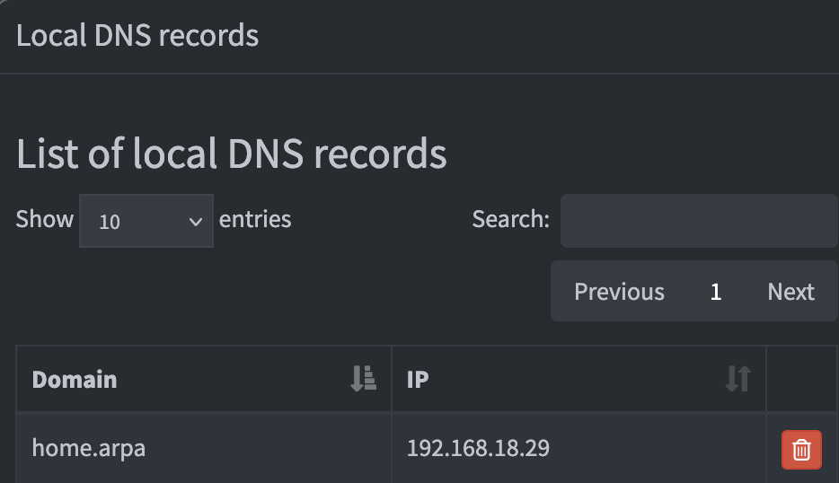

# Setup networking

The main goal of these contains is to make it easy to access other services using hostnames like [http://service.home.arpa].

## Pihole

This acts as the DNS server which reroutes domain requests. This means that traffic would be routed like so:

```
Client/your machine --https://google.com/--> Your router -> Some big company's DNS server --142.250.69.46--> Googles Homepage

# If you try to goto a local domain
Client/your machine --http://jellyfin.home.arpa/--> Your router -> Some big company's DNS server --???--> Could not resolve domain
```

Clearly, if we want to access Jellyfin, we'll need a DNS server that understands where to point the client. Pihole is able to do that!

In the `compose.yaml` file, Pihole exposes the following ports, which are the defualt ports used for DNS purposes:

```
    ports:
      # DNS Ports
      - 53:53/tcp
      - 53:53/udp
```

That means that if we can point the client machine to the computer/server running the Pihole DNS, it could point the client to the correct destination.

Within Pihole, we can goto `Settings > Local DNS Records` and create the links between a requested Domain and the IP we want to redirect to.


Here, we've assigned the domain `home.arpa` to the IP `192.168.18.29`. This IP is a local address, (192.168.x.x is a set of addresses reserved for private LAN's, they only point to devices connected to your home router), and when a browser tries to reach `http://home.arpa`, it will be directed to that device.

We can create many records, such as:

```
IP Address     Domain
"192.168.18.29 home.arpa",
"192.168.18.29 jellyfin.home.arpa",
"192.168.18.29 pihole.home.arpa",
"192.168.18.29 radarr.home.arpa",
"192.168.18.29 jellyseerr.home.arpa",
"192.168.18.29 sonarr.home.arpa",
"192.168.18.29 qbit.home.arpa"
```

If a user types in any of those domains, they will all be directed to the server/device at `192.168.18.29`.

### How can I configure clients to use the pihole server as the DNS Resolver instead of the router?

I've accomplished this through WireGuard. On the client side `wg0.conf`, you can configure the `[INTERFACE]` with a `DNS` line:

```
DNS = 10.0.0.1
```

In this setup, I connect to my local home server through WireGuard at `10.0.0.1`, which runs WireGuard and Pihole in a container. This server, on the local network is `192.168.18.29`. I point `DNS = 10.0.0.1`, so through this WireGuard VPN, all DNS requests goto `10.0.0.1:53`. The Pihole container's port `53` is exposed as the server's port `53`, so it will be able to resolve the DNS request.

So the path taken looks like:

```
Client/your machine --http://jellyfin.home.arpa/--> Pihole (10.0.0.1:53) --192.168.18.29:80--> Server that hosts jellyfin, but not jellyfin yet
```

## Caddy

Pihole only solved one half of the equation for us, once a client is redirected, what then? There needs to be something there to answer, and point the client to the correct service.

Caddy serves that purpose here, while nginx could work, I wasn't able to get it running properly.

All the requests to 192.168.18.29 through the browser automatically goto port `80` if using `http`, and port `443` if using `https`. Lets say the server is hosting Jellyfin at port `8096`, clearly we need some way to get there from port `80`.

Caddy is a easy to configure proxy server, which _proxies_ requests to further destinations. So with something as simple as:

```
# In homelab/networking/caddy/Caddyfile
1 jellyfin.home.arpa {
2     reverse_proxy jellyfin:8096
3     tls internal
4 }
```

We are able to finally access Jellyfin, which lives at port `8096`, by typing in `http://jellyfin.home.arpa` in our browser! As a bonus, Caddy also converts HTTP Connections to HTTPS.

### How the Caddyfile works in this setup

In the above example, we're able to configure what domains need to be reverse proxied to a specific destination.

Reverse proxy definition: a server that sits in front of web servers, intercepting client requests (like from a browser) and forwarding them to the correct backend server

Line 1: The domain that needs to be proxied
Line 2: The destination domain. Here it's simply `jellyfin:8096`, because I hace `Caddy` and `Jellyfin` running in docker containers, and linked them to the same docker network. This allows them to connect to eachother by container name, rather than an IP + port.

```
networks:
  media_net:
    driver: bridge
```

Line 3: Use Caddy's internal, locally-trusted CA to produce certificates for this site for HTTPS access. This will show as `Connection is insecure` in the browser, because the browser doesn't trust the self-signed or internal CA certificate Caddy uses for local domains. You can accept this, or add the root certificate from Caddy to your local client machine.

## Result

So the final path a user request would take would look like:

```
Client/your machine --http://jellyfin.home.arpa/--> Pihole DNS (10.0.0.1:53) --> Caddy (Locally at 192.168.18.29:80) --> https://jellyfin:8096 (Which only Caddy can access)

# If the client makes a request for a non-local DNS Record
Client/your machine --http://jellyfin.home.arpa/--> Pihole DNS (10.0.0.1:53) --Sends request to a big company DNS server like Google--> https://google.com
```

## Setup Instructions

- Ensure each WIreGuard client config has the line:

```
[INTERFACE]
...
DNS=10.0.0.1 # or whatever the WireGuard IP is for the Pihole server
```

- Add the Local DNS Records into Pihole for each domain/subdomain you'd like to redirect locally
- In the Caddyfile, create a site block for each redirected domain/subdomain. Enter the desired `reverse_proxy` destination as well.
